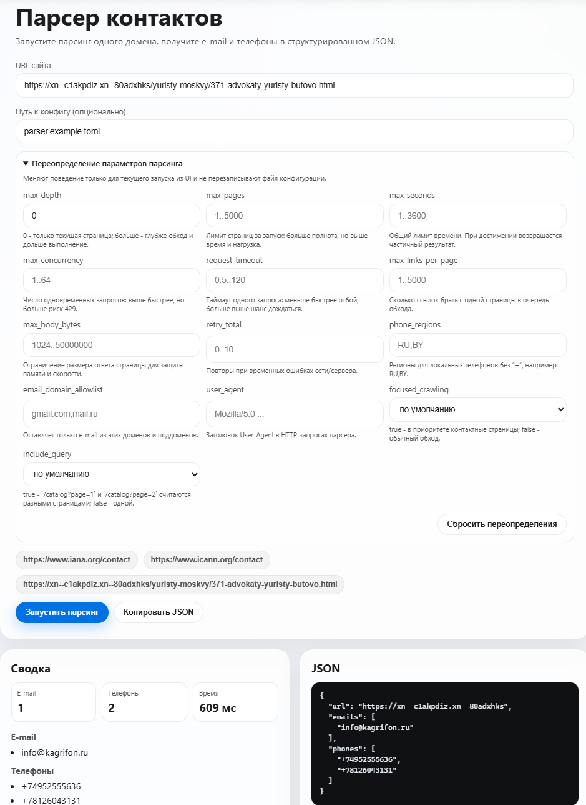
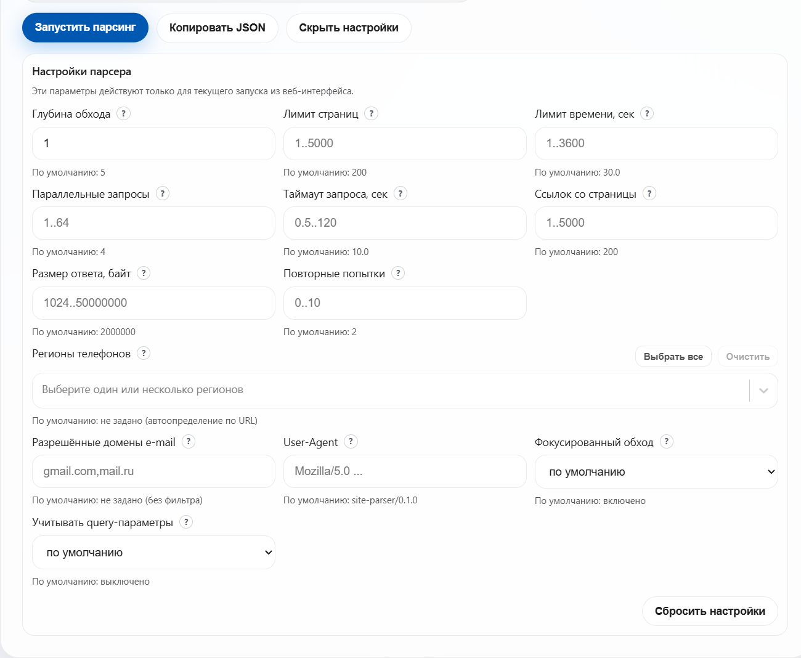

# site-parser

`site-parser` обходит страницы сайта **в пределах одного домена** и извлекает контактные данные: **адреса электронной почты** и **телефонные номера**.

Требуется Python 3.12+.

## Быстрый старт

Локальный запуск CLI:

```bash
python -m venv .venv
# Linux/macOS: source .venv/bin/activate
# Windows (PowerShell): .\.venv\Scripts\Activate.ps1
pip install -r requirements.txt
pip install -e .
site-parser https://www.iana.org/contact --pretty
```

Продакшен-запуск (Docker Compose):

```bash
docker compose -f docker-compose.prod.yml up -d --build
```

После запуска откройте `http://127.0.0.1:8000`.


## Дополнительная документация

- Архитектура и запуск в эксплуатации: `docs/OPERATIONS.md`
- История изменений: `docs/CHANGELOG.md`

## Установка (виртуальное окружение + pip)

Windows (PowerShell):

```powershell
python -m venv .venv
.\.venv\Scripts\Activate.ps1
pip install -r requirements.txt
pip install -e .
```

Linux/macOS (bash):

```bash
python3 -m venv .venv
source .venv/bin/activate
pip install -r requirements.txt
pip install -e .
```

## Dev: локальный запуск (API + UI)

Требуется Node.js 20+.

Терминал 1 (API):

```bash
site-parser-api
```

Терминал 2 (React UI):

```bash
cd frontend
npm install
npm run dev
```

По умолчанию API доступен на `http://127.0.0.1:8000`, UI - на `http://127.0.0.1:5173`.
Внизу интерфейса доступно окно live-логов, где в реальном времени видно ход парсинга и HTTP-запросы.



### Параметры парсинга в веб-интерфейсе

Есть кнопка  `настройки парсера`, где можно задать параметры времени выполнения
без изменения `parser.example.toml` и переменных окружения. Параметры отправляются в `POST /api/parse`
в поле `overrides` (переопределения).



Поддерживаемые поля для изменения:

- `max_pages`, `max_depth`, `max_seconds`, `max_concurrency`
- `request_timeout`, `max_links_per_page`, `max_body_bytes`
- `retry_total`
- `focused_crawling`, `include_query`
- `phone_regions`, `email_domain_allowlist`
- `user_agent`

Пример запроса:

```json
{
  "url": "https://www.iana.org/contact",
  "config": "parser.example.toml",
  "overrides": {
    "max_depth": 1,
    "max_pages": 20,
    "focused_crawling": true,
    "phone_regions": "RU,BY"
  }
}
```

## Продакшен

Для продакшена используйте один API-сервис `site-parser-api` и собранный UI.

Базовый сценарий через Docker Compose:

```bash
# создайте .env.production на основе .env.production.example
docker compose -f docker-compose.prod.yml --env-file .env.production up -d --build
curl http://127.0.0.1:8000/api/health
```

Детальный runbook (переменные API, запуск без Docker, диагностика):
`docs/OPERATIONS.md`.

## CLI и API

### CLI

```bash
site-parser https://www.iana.org/contact
site-parser https://sotohit.ru/
```

Опции:

```bash
site-parser https://www.iana.org/contact --pretty
site-parser https://www.iana.org/contact --log-level DEBUG
site-parser https://www.iana.org/contact --config parser.example.toml
```

- `--pretty` - печатает JSON с отступами (удобно для чтения).
- `--config` - путь к файлу конфигурации (TOML/JSON), пример: `parser.example.toml`.
- `--log-level` - уровень логирования (DEBUG/INFO/WARNING/ERROR).

Пример формата CLI-вывода:

```json
{
  "url": "https://example.com",
  "emails": ["info@example.com", "..."],
  "phones": ["+14155552671", "..."]
}
```

Только текущая страница (без обхода ссылок):

Linux/macOS (bash):

```bash
export PARSER_MAX_DEPTH=0
export PARSER_MAX_PAGES=1
site-parser https://www.iana.org/contact
```

Windows (PowerShell):

```powershell
$env:PARSER_MAX_DEPTH = '0'
$env:PARSER_MAX_PAGES = '1'
site-parser https://www.iana.org/contact
```

### Python API

```python
from site_parser import parse_site

result = parse_site("https://www.iana.org/contact")
print(result["url"], len(result["emails"]), len(result["phones"]))
```

## Конфигурация

Настройки можно задавать:

* через файл конфигурации (**parser.example.toml**)
* через переменные окружения.

### Переменные окружения

| Переменная                             |        По умолчанию | Описание                                                               |
| -------------------------------------- | ------------------: | ---------------------------------------------------------------------- |
| `PARSER_MAX_SECONDS`                   |              `30.0` | Лимит времени обхода, сек.                                             |
| `PARSER_MAX_DEPTH`                     |                 `0` | Максимальная глубина обхода (0 - только стартовая страница)            |
| `PARSER_MAX_PAGES`                     |               `200` | Максимальное количество страниц в обходе                               |
| `PARSER_MAX_LINKS_PER_PAGE`            |               `200` | Максимальное количество ссылок, обрабатываемых с одной страницы        |
| `PARSER_MAX_BODY_BYTES`                |           `2000000` | Максимальный размер тела ответа, байт                                  |
| `PARSER_MAX_CONCURRENCY`               |                 `4` | Уровень параллелизма: число одновременных HTTP-запросов                |
| `PARSER_PHONE_REGIONS`                 |       *(не задано)* | Регионы для разборa локальных телефонов (через запятую), напр. `RU,BY` |
| `PARSER_EMAIL_DOMAIN_ALLOWLIST`        |       *(не задано)* | Белый список доменов e-mail (через запятую), напр. `gmail.com,mail.ru` |
| `PARSER_FOCUSED_CRAWLING`              |              `true` | Фокусированный обход: приоритизация «контактных» страниц               |
| `PARSER_REQUEST_TIMEOUT`               |              `10.0` | Таймаут HTTP-запроса, сек.                                             |
| `PARSER_RETRY_TOTAL`                   |                 `2` | Количество повторных попыток HTTP-запроса                              |
| `PARSER_RETRY_BACKOFF_FACTOR`          |               `0.5` | Коэффициент задержки между повторами (backoff)                         |
| `PARSER_USER_AGENT`                    | `site-parser/0.1.0` | Значение заголовка `User-Agent`                                        |
| `PARSER_INCLUDE_QUERY`                 |             `false` | `true`: `/catalog?page=1` и `/catalog?page=2` - разные URL; `false` - один URL |
| `PARSER_LOG_LEVEL`                     |              `INFO` | Уровень логирования                                                    |
| `PARSER_CONFIG_FILE` / `PARSER_CONFIG` |       *(не задано)* | Путь к файлу конфигурации (если не используете `--config`)             |

### Переменные API-сервера

Описание переменных API-сервера и эксплуатационных параметров вынесено в
`docs/OPERATIONS.md`.

## Тесты

```bash
pytest
```

Тесты проверяют базовые сценарии: ограничение домена, извлечение e-mail/телефонов, фокусированный обход, чтение конфигурации (файл/env), фильтрацию e-mail по белому списку.

## License

Проект распространяется под лицензией MIT. См. файл [LICENSE](LICENSE) для подробностей.
