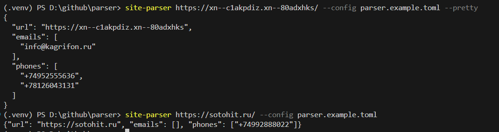

# site-parser

`site-parser` обходит страницы сайта **в пределах одного домена** и извлекает контактные данные: **адреса электронной почты** и **телефонные номера**.

Требуется Python 3.12+.



## Установка (виртуальное окружение + pip)

Windows (PowerShell):

```powershell
python -m venv .venv
.\.venv\Scripts\Activate.ps1
pip install -r requirements.txt
pip install -e .
```

Linux/macOS (bash):

```bash
python3 -m venv .venv
source .venv/bin/activate
pip install -r requirements.txt
pip install -e .
```

## Запуск

CLI:

```powershell
site-parser https://sotohit.ru/
site-parser https://www.iana.org/contact --pretty
site-parser https://www.iana.org/contact --config parser.example.toml --pretty
```

Пример формата CLI-вывода:

```json
{
  "url": "https://example.com",
  "emails": ["info@example.com", "..."],
  "phones": ["+14155552671", "..."]
}
```

## Веб-интерфейс (React)

Требуется Node.js 20+.

1) Запустите API на Python:

Windows (PowerShell):

```powershell
site-parser-api
```

Linux/macOS (bash):

```bash
site-parser-api
```

API по умолчанию поднимается на `http://127.0.0.1:8000`.

2) Запустите React UI:

Windows (PowerShell):

```powershell
cd frontend
npm install
npm run dev
```

Linux/macOS (bash):

```bash
cd frontend
npm install
npm run dev
```

UI по умолчанию работает на `http://127.0.0.1:5173` и обращается к API через `/api`.

3) Продакшен-сборка UI:

```powershell
cd frontend
npm run build
```

После сборки `site-parser-api` автоматически раздаёт `frontend/dist` как статический интерфейс.

### Параметры парсинга в веб-интерфейсе

В форме есть секция `Переопределение параметров парсинга`, где можно задать параметры времени выполнения
без изменения `parser.example.toml` и переменных окружения. Параметры отправляются в `POST /api/parse`
в поле `overrides` (переопределения).

Поддерживаемые поля переопределения:

- `max_pages`, `max_depth`, `max_seconds`, `max_concurrency`
- `request_timeout`, `max_links_per_page`, `max_body_bytes`
- `retry_total`
- `focused_crawling`, `include_query`
- `phone_regions`, `email_domain_allowlist`
- `user_agent`

Пример запроса:

```json
{
  "url": "https://www.iana.org/contact",
  "config": "parser.example.toml",
  "overrides": {
    "max_depth": 1,
    "max_pages": 20,
    "focused_crawling": true,
    "phone_regions": "RU,BY"
  }
}
```

## Продакшен-развёртывание

Для продакшена используйте собранный UI + один API-сервис (без `npm run dev`).

### Вариант 1: Docker Compose (рекомендуется)

```powershell
docker compose -f docker-compose.prod.yml up -d --build
```

Проверка:

```powershell
curl http://127.0.0.1:8000/api/health
```

Остановка:

```powershell
docker compose -f docker-compose.prod.yml down
```

Если нужно изменить параметры, скопируйте `.env.production.example` в `.env.production`
и передайте переменные в compose через `--env-file`.

### Вариант 2: без Docker

1) Сборка UI:

```powershell
cd frontend
npm ci
npm run build
```

2) Запуск API как единственного процесса:

```powershell
site-parser-api
```

Для прод-режима выставьте:

- `SITE_PARSER_API_HOST=0.0.0.0`
- `SITE_PARSER_API_RELOAD=false`
- `SITE_PARSER_API_WORKERS=2` (или больше, по CPU)

## Использование

### Интерфейс командной строки

```powershell
site-parser https://www.iana.org/contact
site-parser https://sotohit.ru/
site-parser https://xn--c1akpdiz.xn--80adxhks/yuristy-moskvy/371-advokaty-yuristy-butovo.html
```

Опции:

```powershell
site-parser https://www.iana.org/contact --pretty
site-parser https://www.iana.org/contact --log-level DEBUG
site-parser https://www.iana.org/contact --config parser.example.toml
```

- `--pretty` - печатает JSON с отступами (удобно для чтения).
- `--config` - путь к файлу конфигурации (TOML/JSON), пример: `parser.example.toml`.
- `--log-level` - уровень логирования (DEBUG/INFO/WARNING/ERROR).

Только текущая страница (без обхода ссылок):

```powershell
$env:PARSER_MAX_DEPTH = '0'
$env:PARSER_MAX_PAGES = '1'
site-parser https://www.iana.org/contact
```

### Python API

```python
from site_parser import parse_site

result = parse_site("https://www.iana.org/contact")
print(result["url"], len(result["emails"]), len(result["phones"]))
```

## Конфигурация

Настройки можно задавать:

* через файл конфигурации (**parser.example.toml**)
* через переменные окружения.

### Переменные окружения

| Переменная                             |        По умолчанию | Описание                                                               |
| -------------------------------------- | ------------------: | ---------------------------------------------------------------------- |
| `PARSER_MAX_SECONDS`                   |              `30.0` | Лимит времени обхода, сек.                                             |
| `PARSER_MAX_DEPTH`                     |                 `0` | Максимальная глубина обхода (0 - только стартовая страница)            |
| `PARSER_MAX_PAGES`                     |               `200` | Максимальное количество страниц в обходе                               |
| `PARSER_MAX_LINKS_PER_PAGE`            |               `200` | Максимальное количество ссылок, обрабатываемых с одной страницы        |
| `PARSER_MAX_BODY_BYTES`                |           `2000000` | Максимальный размер тела ответа, байт                                  |
| `PARSER_MAX_CONCURRENCY`               |                 `4` | Уровень параллелизма: число одновременных HTTP-запросов                |
| `PARSER_PHONE_REGIONS`                 |       *(не задано)* | Регионы для разборa локальных телефонов (через запятую), напр. `RU,BY` |
| `PARSER_EMAIL_DOMAIN_ALLOWLIST`        |       *(не задано)* | Белый список доменов e-mail (через запятую), напр. `gmail.com,mail.ru` |
| `PARSER_FOCUSED_CRAWLING`              |              `true` | Фокусированный обход: приоритизация «контактных» страниц               |
| `PARSER_REQUEST_TIMEOUT`               |              `10.0` | Таймаут HTTP-запроса, сек.                                             |
| `PARSER_RETRY_TOTAL`                   |                 `2` | Количество повторных попыток HTTP-запроса                              |
| `PARSER_RETRY_BACKOFF_FACTOR`          |               `0.5` | Коэффициент задержки между повторами (backoff)                         |
| `PARSER_USER_AGENT`                    | `Mozilla/5.0 (Windows NT 10.0; Win64; x64) AppleWebKit/537.36 (KHTML, like Gecko) Chrome/120.0.0.0 Safari/537.36` | Значение заголовка `User-Agent`                                        |
| `PARSER_INCLUDE_QUERY`                 |             `false` | `true`: `/catalog?page=1` и `/catalog?page=2` - разные URL; `false` - один URL |
| `PARSER_LOG_LEVEL`                     |              `INFO` | Уровень логирования                                                    |
| `PARSER_CONFIG_FILE` / `PARSER_CONFIG` |       *(не задано)* | Путь к файлу конфигурации (если не используете `--config`)             |

### Переменные API-сервера

| Переменная                | По умолчанию | Описание                                 |
| ------------------------- | -----------: | ---------------------------------------- |
| `SITE_PARSER_API_HOST`    | `127.0.0.1`  | Хост для `site-parser-api`               |
| `SITE_PARSER_API_PORT`    |      `8000`  | Порт для `site-parser-api`               |
| `SITE_PARSER_API_WORKERS` |         `1`  | Количество worker-процессов Uvicorn      |
| `SITE_PARSER_API_RELOAD`  |      `false` | Режим автоперезапуска (`1/true/yes/on`) |
| `SITE_PARSER_TRUSTED_HOSTS` | `127.0.0.1,localhost` | Разрешённые значения `Host` заголовка |
| `SITE_PARSER_CORS_ORIGINS` | `http://127.0.0.1:5173,http://localhost:5173` | Разрешённые CORS origin через запятую |

## Как это работает

1. Нормализуется `start_url`, вычисляется базовый домен; обход ограничивается этим доменом.
2. При включённом фокусированном обходе URL ранжируются по эвристикам: «контактные» разделы выше, документация/архивы ниже.
3. Страницы загружаются параллельно пулом потоков с таймаутом, повторными попытками и увеличивающейся задержкой между повторами, а также с ограничением размера ответа.
4. HTML разбирается через BeautifulSoup; контакты извлекаются из текста и ссылок.
5. Ссылки приводятся к абсолютному виду, нормализуются и добавляются в очередь до достижения лимитов.
6. Контакты дедуплицируются и сортируются перед выдачей результата.

## Ограничения

* Некоторые сайты блокируют ботов, требуют выполнения JavaScript или отдают контент только после рендеринга - такой контент парсер может не увидеть.

## Тесты

```powershell
pytest
```

Тесты проверяют базовые сценарии: ограничение домена, извлечение e-mail/телефонов, фокусированный обход, чтение конфигурации (файл/env), фильтрацию e-mail по белому списку.

## License

Проект распространяется под лицензией MIT. См. файл [LICENSE](LICENSE) для подробностей.
